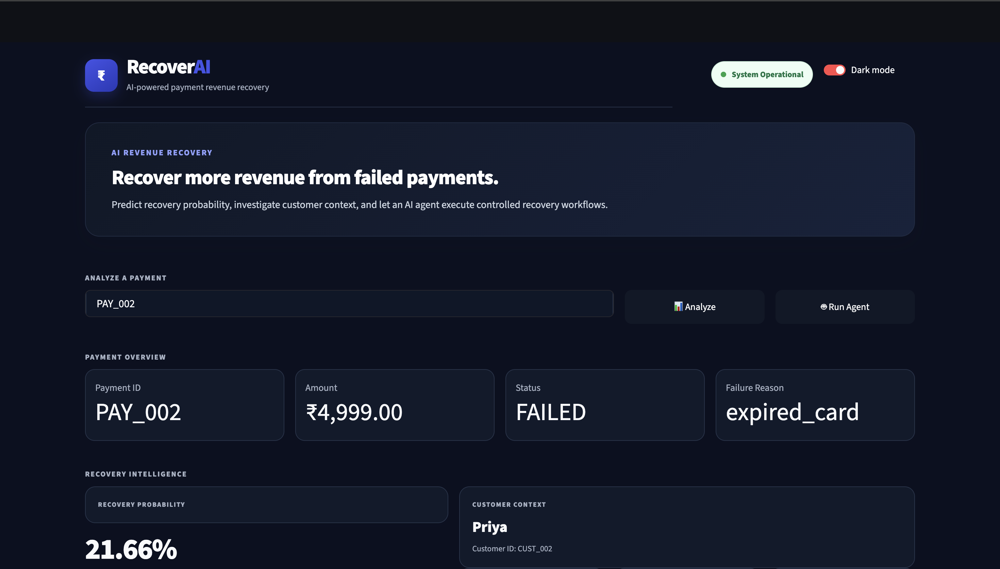

<div align="center">

# 💳 RecoverAI

### AI-Powered Payment Revenue Recovery System

**Predict failed-payment recovery probability → investigate context → take controlled recovery actions → maintain an audit trail.**

<p>
  
  
  
  
  
  
</p>

</div>

---

## 🚀 What is RecoverAI?

RecoverAI is an end-to-end AI system for **payment revenue recovery**.

When a payment fails, the system:

1. Retrieves payment and customer context.
2. Uses an **XGBoost classification pipeline** to estimate recovery probability.
3. Passes that context to an **AI agent**.
4. Lets the agent request controlled application tools.
5. Applies business rules before actions are executed.
6. Records recovery actions in SQLite for an auditable workflow.

> **Core idea:** The ML model predicts *what is likely to happen*. The agent decides *what to do about it*.

---

## 🎯 The Problem

Failed payments create revenue leakage for subscription and payment businesses.

A recovery system needs to answer:

- Why did the payment fail?
- How likely is it to be recovered?
- Should the payment be retried?
- When should it be retried?
- Should the customer be notified?
- When should the case be escalated?
- How should every action be recorded?

RecoverAI turns those questions into an automated, tool-driven workflow.

---

## 🧠 How It Works

```text
                    FAILED PAYMENT
                          │
                          ▼
                 ┌─────────────────┐
                 │ Payment +       │
                 │ Customer Data   │
                 └────────┬────────┘
                          │
                          ▼
                 ┌─────────────────┐
                 │  XGBoost Model  │
                 │ Recovery        │
                 │ Probability     │
                 └────────┬────────┘
                          │
                          ▼
                 ┌─────────────────┐
                 │    AI Agent     │
                 │ Investigate +   │
                 │ Decide          │
                 └────────┬────────┘
                          │
                          ▼
                 ┌─────────────────┐
                 │ Policy /        │
                 │ Guardrails      │
                 └────────┬────────┘
                          │
                ┌─────────┼─────────┐
                ▼         ▼         ▼
             Retry    Notify    Escalate
                │         │         │
                └─────────┼─────────┘
                          ▼
                 ┌─────────────────┐
                 │ SQLite + Audit  │
                 │ Trail           │
                 └─────────────────┘
```

### System Architecture

```text
┌──────────────────┐
│    Streamlit     │
│    Dashboard     │
└────────┬─────────┘
         │
         ▼
┌──────────────────┐
│     FastAPI      │
│       API        │
└────────┬─────────┘
         │
    ┌────┴───────────────────┐
    │                        │
    ▼                        ▼
┌──────────────┐       ┌────────────────┐
│ XGBoost ML   │       │  OpenAI Agent  │
│ Model        │       │                │
└──────┬───────┘       └───────┬────────┘
       │                       │
       │                 ┌─────▼─────┐
       │                 │   Tools   │
       │                 └─────┬─────┘
       │                       │
       └───────────┬───────────┘
                   ▼
          ┌──────────────────┐
          │      SQLite      │
          │     Database     │
          └──────────────────┘
```

---

## 🤖 Agent Workflow

For a failed payment such as `PAY_001`:

```text
Payment ID
    │
    ▼
get_payment()
    │
    ▼
get_customer()
    │
    ▼
predict_customer_recovery()
    │
    ▼
Recovery Probability
    │
    ▼
Policy / Agent Decision
    │
    ├──► schedule_retry()
    │
    ├──► send_notification()
    │
    ├──► escalate_case()
    │
    └──► log_action()
```

The LLM does **not** directly manipulate the database.

Instead:

```text
LLM
 ↓
Tool Request
 ↓
Policy Validation
 ↓
Application Tool
 ↓
SQLite
```

This separates reasoning from application-side execution and provides a place to enforce business rules.

---

## 📊 Machine Learning

RecoverAI uses an **XGBoost classification pipeline** for recovery prediction.

### Features

The model uses features including:

- Customer age
- Customer tenure
- Payment amount
- Previous payment success rate
- Previous failed payments
- Days since last payment
- Payment method
- Failure reason
- Subscription age
- Customer lifetime value
- Previous recovery count
- Failure rate
- Customer reliability score
- Recovery history

### Example Prediction

For `PAY_001`:

```text
Recovery Probability: 57.76%
Prediction:           1
Recovery Level:       medium_recovery
```

---

## 📈 Model Performance

Current evaluation:

| Metric | Score |
|:---|---:|
| Accuracy | **69.50%** |
| Precision | **55.26%** |
| Recall | **35.32%** |
| F1 Score | **43.10%** |
| ROC-AUC | **70.59%** |
| PR-AUC | **51.65%** |

> Accuracy is not treated as the only metric because recovery prediction is a business decision problem involving class imbalance and different costs for false positives and false negatives.

---

## 💳 Example Recovery Flow

### Payment

```text
Payment ID: PAY_001
Customer:   Rahul
Amount:     ₹1,999
Status:     failed
Failure:    insufficient_funds
```

### Customer History

```text
Tenure:              24 months
Successful payments: 23
Failed payments:     1
Lifetime value:      ₹15,000
```

### Model

```text
Recovery probability: 57.76%
Recovery level:       medium_recovery
```

### Agent Actions

```text
1. Schedule retry in 24 hours
2. Notify customer
3. Log recovery action
```

### Result

```text
Recovery decision:
Retry + customer notification

Retry:
24 hours

Audit:
Action recorded in SQLite
```

---

## 🛡️ Safety & Guardrails

RecoverAI uses a controlled tool-based architecture.

The agent can request:

```text
get_payment()
get_customer()
predict_customer_recovery()
schedule_retry()
send_notification()
escalate_case()
log_action()
```

The important design principle is:

> **The model can request an action, but application logic controls how that action is executed.**

This creates a clear boundary between AI reasoning and business-side execution.

---

## 🖥️ Dashboard

RecoverAI includes a Streamlit dashboard for interacting with the recovery system.

The dashboard provides:

- Customer information
- Payment information
- Recovery probability
- Recovery level
- Recovery audit trail
- AI recovery workflow

### Add your screenshots here

Once you have the final UI screenshots, place them in the repository and replace these placeholders:

```text
docs/
├── dashboard.png
├── prediction.png
└── agent-workflow.png
```

Then add:

```markdown

```

A short GIF showing the complete workflow would make the repository even stronger.

---

## 🧩 Tech Stack

| Layer | Technologies |
|:---|:---|
| **Frontend** | Streamlit |
| **Backend** | Python, FastAPI, Pydantic |
| **Machine Learning** | Scikit-learn, XGBoost, Pandas, NumPy, Joblib |
| **AI** | OpenAI API, OpenAI Responses API, Function/Tool Calling |
| **Database** | SQLite |
| **Development** | Git, GitHub, Python virtual environment |

---

## 🔌 API

### Health Check

```http
GET /health
```

Example:

```json
{
  "status": "healthy"
}
```

### ML Prediction

```http
POST /predict-recovery
```

Request:

```json
{
  "payment_id": "PAY_001"
}
```

Response:

```json
{
  "payment_id": "PAY_001",
  "recovery_probability": 0.5776,
  "recovery_prediction": 1,
  "recovery_level": "medium_recovery"
}
```

### AI Recovery

```http
POST /agent-recovery
```

Request:

```json
{
  "payment_id": "PAY_001"
}
```

The agent investigates the payment, evaluates recovery likelihood, chooses recovery actions, executes approved tools, and returns a recovery plan.

---

## ⚡ Run Locally

### 1. Clone

```bash
git clone https://github.com/debugkrishna/recover-ai.git
cd recover-ai
```

### 2. Create a virtual environment

```bash
python3 -m venv .venv
source .venv/bin/activate
```

### 3. Install dependencies

```bash
pip install -r requirements.txt
```

### 4. Configure environment variables

Create `.env` in the project root:

```env
OPENAI_API_KEY=your_api_key_here
```

**Never commit `.env` or expose your API key.**

### 5. Start FastAPI

```bash
uvicorn app.main:app --reload
```

API:

```text
http://127.0.0.1:8000
```

Swagger:

```text
http://127.0.0.1:8000/docs
```

### 6. Start Streamlit

In another terminal:

```bash
PYTHONPATH=. streamlit run ui/app.py
```

Enter a payment ID such as:

```text
PAY_001
```

---

## 🧪 Testing

### API health

```bash
curl http://127.0.0.1:8000/health
```

### ML prediction

```bash
curl -X POST http://127.0.0.1:8000/predict-recovery -H "Content-Type: application/json" -d '{"payment_id":"PAY_001"}'
```

### Agent

```bash
python -m agent.agent
```

---

## 📁 Project Structure

```text
RecoverAI/
│
├── agent/
│   ├── agent.py
│   ├── policy.py
│   ├── prompts.py
│   └── tools.py
│
├── app/
│   ├── main.py
│   └── schemas.py
│
├── ml/
│   ├── train.py
│   ├── predict.py
│   ├── features.py
│   ├── evaluate.py
│   └── artifacts/
│       ├── recovery_model.pkl
│       └── preprocessor.pkl
│
├── ui/
│   └── app.py
│
├── database.py
├── recoverai.db
├── requirements.txt
├── .gitignore
└── README.md
```

---

## 🗄️ Database

SQLite maintains application state for:

- Customers
- Payments
- Retry attempts
- Notifications
- Recovery actions

Recovery actions are linked to the relevant payment and customer, creating an auditable workflow.

---

## 🔮 Future Improvements

- Real payment gateway integration
- Production notification providers
- Automated retry scheduling
- Customer segmentation
- Model monitoring
- Recovery strategy A/B testing
- Model explainability
- PostgreSQL for production
- Authentication and authorization
- Docker deployment
- Cloud deployment
- Recovery revenue analytics
- Better temporal features from real payment history
- Automated evaluation and regression tests

---

## 🎯 Why RecoverAI?

RecoverAI demonstrates an end-to-end AI engineering workflow:

```text
Data
 ↓
Machine Learning
 ↓
Prediction API
 ↓
AI Agent
 ↓
Tool Calling
 ↓
Business Rules
 ↓
Database
 ↓
Action
 ↓
Audit Trail
```

The project focuses on a **working AI system rather than an isolated ML model**.

It demonstrates how a predictive model can be embedded inside an agentic workflow that takes controlled, auditable business actions.

---

## 👨‍💻 Author

### Krishna Arun Magotra

**Information Technology — NIT Srinagar**

[GitHub](https://github.com/debugkrishna)

---

## 📌 Project Status

```text
✅ ML recovery model
✅ Model persistence
✅ FastAPI API
✅ SQLite database
✅ AI agent
✅ OpenAI tool calling
✅ Recovery tools
✅ Policy / guardrails
✅ Retry scheduling
✅ Customer notifications
✅ Audit logging
✅ Streamlit dashboard
✅ GitHub documentation
```

**More production-oriented features are planned.**

---

<div align="center">

### Built to explore AI-powered revenue recovery.

⭐ If you find RecoverAI interesting, consider starring the repository.

</div>
